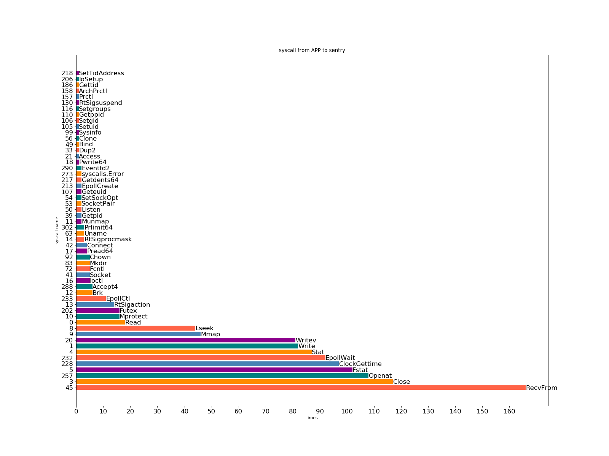
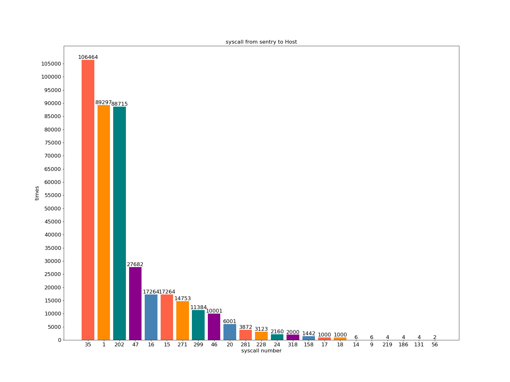

# Nginx & gVisor

### Abstract

This is my first task given by my master mentor Dr. Wenbo. 

The main idea is to find system calls between **Nginx and gvisor**, **gvisor and host kernel**.

There are mainly three steps of this task:

* deploy the Nginx to local docker engine and run it with runtime gvisor
* find the system calls between Nginx and gvisor sentry
* find the system calls between gvisor and host kernel

### Deployment

According to [this blog](https://www.runoob.com/docker/docker-install-nginx.html), we can download Nginx image from docker hub and run it with docker.

```shell
$ docker pull nginx
```

Here we pull the official image from docker hub.

```
$ docker run --name nginx-test -p 8081:80 -d nginx
```

Here we run this image with some args:

* **nginx-test** is its name
* **8081** is its ports, we use -p to set local 8081 port to 80 port inside the container
* this container runs in the **background** since -d

After these instructions, open the browser and type '127.0.0.1:8081', you will see the "welcome page" of Nginx.

Then we create directory to store files and add mapping relationship to the container we run.

```shell
$ mkdir -p ~/nginx/www ~/nginx/logs ~/nginx/conf
$ docker cp 6dd4380ba708:/etc/nginx/nginx.conf ~/nginx/conf
```

Here `6dd4380ba708` is the container ID, which we can use `docker ps` to get it.

* `www` is the virtual directory of Nginx
* `logs` is the directory we store logs
* the file in the `conf` will mapping as the configuration file of Nginx

Finally we add a `index.html` file to `www`, which will be the home page.

```html
<!DOCTYPE html>
<html>
<head>
<meta charset="utf-8">
<title>zty's web</title>
</head>
<body>
    <h1>我的第一个标题</h1>
    <p>我的第一个段落。</p>
</body>
</html>
```

### Syscalls from Nginx to gvisor

调了一个日志里面有的syscall - read (××××.boot)

```
nginx E read(0x3 /lib/x86_64-linux-gnu/libdl-2.28.so, 0x7f2d2c4640d8, 0x340)
```

在`pkg/sentry/syscalls/linux/sys_read.go`这文件里面修改 gvisor 实现的 read 系统调用，增加 print stack trace 代码

```go
func Read(t *kernel.Task, args arch.SyscallArguments) (uintptr, *kernel.SyscallControl, error) {
	// add by zty in oder to watch stack trace
	db.PrintStack()
```

重新编译运行之后，在日志当中的输出如下

```
goroutine 40 [running]:
runtime/debug.Stack(0xd0853a, 0xd, 0x0)
	GOROOT/src/runtime/debug/stack.go:24 +0x9d
runtime/debug.PrintStack()
	GOROOT/src/runtime/debug/stack.go:16 +0x22
gvisor.googlesource.com/gvisor/pkg/sentry/syscalls/linux.Read(0xc0004c8000, 0x3, 0x7f2d2c4640d8, 0x340, 0x0, 0x0, 0x7f2d2c4640bf, 0x0, 0x0, 0x0, ...)
	pkg/sentry/syscalls/linux/sys_read.go:49 +0x7e
gvisor.googlesource.com/gvisor/pkg/sentry/kernel.(*Task).executeSyscall(0xc0004c8000, 0x0, 0x3, 0x7f2d2c4640d8, 0x340, 0x0, 0x0, 0x7f2d2c4640bf, 0xc0004fe090, 0xc0004d7d30, ...)
	pkg/sentry/kernel/task_syscall.go:165 +0x10a
gvisor.googlesource.com/gvisor/pkg/sentry/kernel.(*Task).doSyscallInvoke(0xc0004c8000, 0x0, 0x3, 0x7f2d2c4640d8, 0x340, 0x0, 0x0, 0x7f2d2c4640bf, 0x0, 0x7f2d2c4640bf)
	pkg/sentry/kernel/task_syscall.go:283 +0x69
gvisor.googlesource.com/gvisor/pkg/sentry/kernel.(*Task).doSyscallEnter(0xc0004c8000, 0x0, 0x3, 0x7f2d2c4640d8, 0x340, 0x0, 0x0, 0x7f2d2c4640bf, 0x0, 0x0)
	pkg/sentry/kernel/task_syscall.go:244 +0x96
gvisor.googlesource.com/gvisor/pkg/sentry/kernel.(*Task).doSyscall(0xc0004c8000, 0x2, 0xc00021e040)
	pkg/sentry/kernel/task_syscall.go:219 +0x13d
gvisor.googlesource.com/gvisor/pkg/sentry/kernel.(*runApp).execute(0x0, 0xc0004c8000, 0xe27d00, 0x0)
	pkg/sentry/kernel/task_run.go:219 +0xe09
gvisor.googlesource.com/gvisor/pkg/sentry/kernel.(*Task).run(0xc0004c8000, 0x1)
	pkg/sentry/kernel/task_run.go:91 +0x194
created by gvisor.googlesource.com/gvisor/pkg/sentry/kernel.(*Task).Start
	pkg/sentry/kernel/task_start.go:286 +0xfe
```

定位到 `pkg/sentry/kernel/task_syscall.go` 文件，找到了 `doSyscall()` 函数

```go
// doSyscall is the entry point for an invocation of a system call specified by
// the current state of t's registers.
//
// The syscall path is very hot; avoid defer.
func (t *Task) doSyscall() taskRunState {
	sysno := t.Arch().SyscallNo()
	args := t.Arch().SyscallArgs()
    
	// add by zty in oder to get syscall number
	log.Infof("Syscall %d: called from APP", sysno)
```


```python
import re

path = '/tmp/runsc/runsc.log.20190817-222714.915316.boot'

syscall_num_set = set()

with open(path) as f:
    for line in f:
        if 'from APP' in line:
            #print(re.findall(r"", line))
            temp_str = line[line.find("Syscall"):]
            #print(re.findall(r"\d+", temp_str))
            syscall_num_set.add(re.findall(r"\d+", temp_str)[0])

print(len(syscall_num_set))
syscall_num_list = [int(i) for i in syscall_num_set]
syscall_num_list.sort()
print(syscall_num_list)
```


```shell
$ python3 collect_syscall.py 
54
[0, 1, 3, 4, 5, 8, 9, 10, 11, 12, 13, 14, 16, 17, 18, 20, 21, 33, 39, 41, 42, 45, 49, 50, 53, 54, 56, 63, 72, 83, 92, 99, 105, 106, 107, 110, 116, 130, 157, 158, 186, 202, 206, 213, 217, 218, 228, 232, 233, 257, 273, 288, 290, 302]
```




### Syscalls from gvisor to Host

两个思路

* 一个是从 gVisor 的系统调用过程入手，找到 gvisor 向 kernel 发出调用请求的入口
* 一个是将 gVisor 视为一个普通的进程，观察该进程的所有 syscall

#### gVisor 的系统调用过程

前文在 **Syscalls from Nginx to gvisor** 这一节里面，涉及到了 gVisor 在进行系统调用时的一系列操作，那么现在深入研究这一部分，究竟是在哪一部分，哪个环节里面，gVisor 向 host kernel 发出了 syscall 调用请求。

再放一遍 stack trace (simplified)

```
gvisor/pkg/sentry/syscalls/linux.Read()
	pkg/sentry/syscalls/linux/sys_read.go:49 +0x57
gvisor/pkg/sentry/kernel.(*Task).executeSyscall()
	pkg/sentry/kernel/task_syscall.go:168 +0x10a
gvisor/pkg/sentry/kernel.(*Task).doSyscallInvoke()
	pkg/sentry/kernel/task_syscall.go:289 +0x69
gvisor/pkg/sentry/kernel.()
	pkg/sentry/kernel/task_syscall.go:250 +0x96
gvisor/pkg/sentry/kernel.(*Task).doSyscall()
	pkg/sentry/kernel/task_syscall.go:225 +0x13d
gvisor/pkg/sentry/kernel.(*runApp).execute()
	pkg/sentry/kernel/task_run.go:219 +0xe09
gvisor/pkg/sentry/kernel.(*Task).run()
	pkg/sentry/kernel/task_run.go:91 +0x194
created by gvisor/pkg/sentry/kernel.(*Task).Start
	pkg/sentry/kernel/task_start.go:286 +0xfe
```

关于第二个思路，我采用了 `strace` 命令来追踪 sentry 的系统调用，结果碰到了一些问题，一个是当 `strace docker run --runtime=runsc-kvm ....` 的时候，由于docker的一些机制，导致我追踪到的并不是真正的sentry进程，若是使用 `runsc run` [命令直接启动容器](https://gvisor.dev/docs/user_guide/oci/)的时候，又会因为 config.json 文件的编写以及一些参数问题，会有访问权限不对的问题出现，和老师商量之后，还是决定从第一种方法入手。

原因有很多个，但较为重要的目标现在明确了，就是**在 nginx 正常运行的时候，我们去关注他的系统调用，到底有什么**。即在实际工作场景当中，最常见的状态就是 nginx 已经启动，这个时候的 syscall 使我们需要注意的。

我在 gVisor 论坛上提出了[相关问题](https://groups.google.com/d/msg/gvisor-users/B8mkgwiJFOY/wofIzThVAwAJ)，想从 sentry 和 host OS 之间的 seccomp 入手，找到所有从 sentry 发往 Host 的 syscall。通过回复我了解到 sentry 和 Host 之间的 seccomp，是在`gvisor/runsc/boot/filter/filter.go`这个文件当中定义的，现在来仔细研究一下这个文件。

首先是注释

```go
// Package filter defines all syscalls the sandbox is allowed to make
// to the host, and installs seccomp filters to prevent prohibited
// syscalls in case it's compromised.
```

`gvisor/runsc/boot/filter` 这个包定义了所有允许从sentry到host的syscall，并且 install 了拦截禁用syscall的过滤器。

```go
// Install installs seccomp filters for based on the given platform.
func Install(opt Options) error {
```

`Install`函数首先check了所有相关参数，补充了所有允许的syscall，然后调用了`seccomp.Install()` 函数(`pkg/seccomp/seccomp.go`)来进行 filter 的 install。而在这个函数里面，真正install的代码是

```go
	// Perform the actual installation.
	if errno := SetFilter(instrs); errno != 0 {
		return fmt.Errorf("Failed to set filter: %v", errno)
	}
```

转到 `SetFilter()` 函数的定义位置

```go
// SetFilter installs the given BPF program.
//
// This is safe to call from an afterFork context.
//
//go:nosplit
func SetFilter(instrs []linux.BPFInstruction) syscall.Errno {
	// PR_SET_NO_NEW_PRIVS is required in order to enable seccomp. See seccomp(2) for details.
	if _, _, errno := syscall.RawSyscall(syscall.SYS_PRCTL, linux.PR_SET_NO_NEW_PRIVS, 1, 0); errno != 0 {
		return errno
	}

	sockProg := sockFprog{
		Len:    uint16(len(instrs)),
		Filter: (*linux.BPFInstruction)(unsafe.Pointer(&instrs[0])),
	}
	return seccomp(linux.SECCOMP_SET_MODE_FILTER, linux.SECCOMP_FILTER_FLAG_TSYNC, unsafe.Pointer(&sockProg))
}
```

参考[这篇文章]([https://veritas501.space/2018/05/05/seccomp%E5%AD%A6%E4%B9%A0%E7%AC%94%E8%AE%B0/](https://veritas501.space/2018/05/05/seccomp学习笔记/))，关于利用 `prctl` 系统调用来实现 seccomp 功能。这里的 `setFilter()` 是 `sockFprog` 类型的 `sockProg` 变量，同时设置了该进程不能拥有 root 权限(`PR_SET_NO_NEW_PRIVS`)再调用了 `seccomp` 函数

```go
// seccomp calls seccomp(2). This is safe to call from an afterFork context.
//
//go:nosplit
func seccomp(op, flags uint32, ptr unsafe.Pointer) syscall.Errno {
	if _, _, errno := syscall.RawSyscall(SYS_SECCOMP, uintptr(op), uintptr(flags), uintptr(ptr)); errno != 0 {
		return errno
	}
	return 0
}

```

`seccomp()` 进行了系统调用，将之前组合好的 `sockFprog` 作为参数，实现了 seccomp 的功能。

-------------------------------------------------------------------

和老师讨论了一下，先把目标集中在sentry不能实现的syscall上面，即application(Nginx)向sentry发出了syscall，但这个syscall并没有被sentry implement，这个时候会发生一个函数的调用

```go
//gvisor/blob/master/pkg/sentry/syscalls/linux/linux64.go
	Missing: func(t *kernel.Task, sysno uintptr, args arch.SyscallArguments) (uintptr, error) {
		t.Kernel().EmitUnimplementedEvent(t)
		return 0, syserror.ENOSYS
	},
```

在sentry执行applicaition的syscall的时候，最终会进入到`executeSyscall()`函数中

```go
// pkg/sentry/kernel/task_syscall.go:executeSyscall()
		fn := s.Lookup(sysno)
		if fn != nil {
			// Call our syscall implementation.
			rval, ctrl, err = fn(t, args)
		} else {
			// Use the missing function if not found.
			rval, err = t.SyscallTable().Missing(t, sysno, args)
		}
```

当SyscallTable(定义在`pkg/sentry/syscalls/linux/linux64.go`)当中没有对应的syscall，即application的syscall是unimplemented，会call上文给出的`Missing()`函数。

那么如果要收集Nginx所有发给sentry但最终sentry并未实现的syscall，只要在 `Missing()` 函数当中添加日志输出即可。以防万一，先查看一下该函数调用的 `Kernel().EmitUnimplementedEvent()`函数。

```go
// pkg/sentry/kernel/kernel.go
//
// EmitUnimplementedEvent emits an UnimplementedSyscall event via the event
// channel.
func (k *Kernel) EmitUnimplementedEvent(ctx context.Context) {
	t := TaskFromContext(ctx)
	eventchannel.Emit(&uspb.UnimplementedSyscall{
		Tid:       int32(t.ThreadID()),
		Registers: t.Arch().StateData().Proto(),
	})
}
```

然后锁定 `eventchannel.Emit`

```go
// runsc/boot/compat.go
//
// Emit implements eventchannel.Emitter.
func (c *compatEmitter) Emit(msg proto.Message) (bool, error) {
	switch m := msg.(type) {
	case *spb.UnimplementedSyscall:
		c.emitUnimplementedSyscall(m)
	case *ucspb.UncaughtSignal:
		c.emitUncaughtSignal(m)
	}
	return false, nil
}
```

在Missing Syscall的handle路径上面加入print syscall number之后，结果并没有发现有输出，那么至少在运行基本的Nginx功能时，没有相关的sentry未implement的syscall。

##### 现在想去做两点

* 第一是参考[这个回答](https://groups.google.com/d/msg/gvisor-users/B8mkgwiJFOY/pCTwvOTpAwAJ)对runtime的sentry去看看具体做了哪些系统调用，对比运行其他的image有何不同
* 第二是直接在gvisor里头调用syscall(没有被实现的)，看看具体的操作是什么，是不是真的有传递到Host里面

对于sentry在runtime的时候到底做了什么syscall，参考之前的论坛回答，我编写了以下脚本

```shell
#!/bin/bash
CID=$(docker run --runtime=runsc-kvm -d -p 8082:80 --name nginx-web --rm -v ~/dev/nginx/www:/usr/share/nginx/html -v ~/dev/nginx/conf/nginx.conf:/etc/nginx/nginx.conf -v ~/dev/nginx/logs:/var/log/nginx nginx)
PID=$(docker inspect -f='{{.State.Pid}}' $CID)
sudo strace -p $PID
```

通过container ID来获取Process ID，然后用`strace -p` 来追踪syscall，结果如下

```shell
zty@onepiece:nginx$ ./strace-deploy.sh 
strace: Process 10603 attached
futex(0x14c6048, FUTEX_WAIT_PRIVATE, 0, NULL) = ?
+++ exited with 0 +++
```

只有一个syscall futex()，而且还是没有返回值的那种，最后执行 `docker stop` 之后追踪就停止了。

所以总结来说就是**在运行 Nginx 的时候，sentry 并没有发生向 Host 发出 syscall 的行为。**

但上述结论是**错误的**。

#### 真正的 Syscall from Sentry to Host

参考论坛关于 [**sentry syscall**](https://groups.google.com/d/msg/gvisor-users/B8mkgwiJFOY/jU5BR-OsBAAJ) 的回答，上述命令**并没有追踪到所有的线程**，要加上参数 `-f` 来获取所有 threads 的 syscall，同时明确了 sentry 在 APP Running 的状态下不止有一个 futex syscall，但还有什么其他的 syscall **取决于具体的 APP**。

**If it is just sleeping or performing purely sandbox-internal operations (internal tmpfs, pipes, signals, etc), I could imagine only seeing futex plus platform-related syscalls (ptrace for ptrace, KVM ioctls for KVM).**

如果没有 APP 的要求下，那 syscall 就是有限的几个。

在加上 `-f` 参数之后，我得到了一系列的syscall，**统计出来的图表如下**



总共是 **29** 个系统调用，同时将这些系统调用和 `runsc/boot/filter/config.go` 文件当中声明的系统调用作对比，发现了几个不在 allow list 里面的 syscall。

*和导师交流了之后，再次确认是不是的确只有29个*。

结果发现，做了三次，三次的结果不一致，第一次29个，第二次27个，第三次33个。3


##### 理论上不允许调用的 syscall

| syscall name    | number | times |
| --------------- | ------ | ----- |
| accept          | 43     | 7     |
| rt_sigtimedwait | 128    | 1     |

回到源代码 check

```go
// runsc/boot/filter/config.go
// kvmFilters returns syscalls made exclusively by the KVM platform.
func kvmFilters() seccomp.SyscallRules {
	return seccomp.SyscallRules{
		syscall.SYS_ARCH_PRCTL:      {},
		syscall.SYS_IOCTL:           {},
		syscall.SYS_MMAP:            {},
		syscall.SYS_RT_SIGSUSPEND:   {},
		syscall.SYS_RT_SIGTIMEDWAIT: {},
		0xffffffffffffffff:          {}, // KVM uses syscall -1 to transition to host.
	}
}
```

在这里加入到允许的syscall当中去了，**所以 `rt_sigtimedwait` 这个syscall是被allow的。**

**同时需要注意一点，就是不同的platform会有不同的额外的syscall allow。**

对于 syscall `accept` 也有相应的 allow

```go
// runsc/boot/filter/config.go
func controlServerFilters(fd int) seccomp.SyscallRules {
	return seccomp.SyscallRules{
		syscall.SYS_ACCEPT: []seccomp.Rule{
			{
				seccomp.AllowValue(fd),
			},
		},
		// ...
}
```

**因此所有的system call，在本次查找到的，全部是被允许的。**


##### 调用的发生点

为何上述syscall会发生呢？在 gvisor 的源码当中，有许多处调用 go 语言的 syscall 包来实现实现对于系统调用的call，如最经典的 `syscall.Syscall()` 形式，通过运行以下命令，可以获取到所有包含 `syscall.xxxx()`形式的调用点

```go
$ grep -r "syscall\.\w*(" gvisor/
```

总共546处。


##### 我现在又有两个想法

* 首先看 APP 向 sentry 发的 syscall 是怎么实现的，在实现过程当中有哪些 syscall 是 sentry 需要通过向 host 发 syscall 来做的
* 其次观察在上述 `grep` 命令当中，所有的系统调用，是不是都是 seccomp 允许的。


上次和老师交流，并不是所有被允许的 syscall 都是必须的，因此能够找到冗余的 syscall 是这次研究的关键，或者说存在一些会 crash 的路径，也是值得思考的问题。

第一个想法去尝试了，发现很困难，因为许多函数都是用的 interface 函数，精确的找到定义很困难，也非常的复杂。

比如找 `Read()` 这个 syscall，它在 `pkg/sentry/syscalls/linux/sys_read.go` 文件当中被定义，但是这个函数其实调用的是 `readv()` 函数，转到同文件下的 `read()`，逐步逐步深入到可能涉及系统调用的函数里面去，就到了 `pkg/sentry/fs/file_operations.go` 下面的 `FileOperations` interface 中的 `Read()` 函数。而这个函数具体是怎么调用的，要看调用者的属性，而且查找该函数的 implementation 很难。


第二个想法，需要先锁定grep出来的 syscall 调用入口，具体是进行什么syscall。

开始统计，以 `idea/syscall.txt`这个文件为准。不同 gvisor 版本可能会有差别。

| file                                           | function                            | syscall       |
| ---------------------------------------------- | ----------------------------------- | ------------- |
| runsc/container/container_test.go              | syscall.Syscall6(syscall.SYS_WAITID | SYS_WAITID    |
| runsc/container/container_test.go              | syscall.Stat(                       | SYS_FSTATAT64 |
| runsc/container/container_test.go              | syscall.Mount(                      | SYS_MOUNT     |
| gvisor/runsc/container/multi_container_test.go | syscall.Wait4(                      | SYS_WAIT4     |
|                                                | syscall.Kill(                       | SYS_KILL      |
|                                                |                                     |               |
|                                                |                                     |               |
|                                                |                                     |               |
|                                                |                                     |               |


对于第二个问题，我做了一个实验

通过阅读代码，我了解到第`68-71`号系统调用均没有被implement，因此编写一个会进行这些系统调用的c程序，然后在gvisor里面运行它，就可以知道这些没有被implement的syscall有没有传递到Host Kernel并实现。

```c
// copy from https://blog.csdn.net/guoping16/article/details/6584024
#include <stdio.h>
#include <string.h>
#include <stdlib.h>
#include <unistd.h>
#include <sys/ipc.h>
#include <sys/msg.h>
#include <error.h>
#define TEXT_SIZE 512

struct msgbuf
{
    long mtype;
    char mtext[TEXT_SIZE];
};

int main(int argc, char **argv)
{
    int msqid;
    struct msqid_ds info;
    struct msgbuf buf;
    struct msgbuf buf1;
    int flag;
    int sendlength, recvlength;
    
    msqid = msgget( IPC_PRIVATE, 0666 );
    if ( msqid < 0 )
    {
        perror("get ipc_id error");
        return -1;
    }
    
    buf.mtype = 1;
    strcpy(buf.mtext, "happy new year!");
    sendlength = sizeof(struct msgbuf) - sizeof(long);
    flag = msgsnd( msqid, &buf, sendlength , 0 );
    
    if ( flag < 0 )
    {
        perror("send message error");
        return -1;
    }
    
    buf.mtype = 3;
    strcpy(buf.mtext, "good bye!");
    sendlength = sizeof(struct msgbuf) - sizeof(long);
    flag = msgsnd( msqid, &buf, sendlength , 0 );
    
    if ( flag < 0 )
    {
        perror("send message error");
        return -1;
    }
    
    flag = msgctl( msqid, IPC_STAT, &info );
    if ( flag < 0 )
    {
        perror("get message status error");
        return -1;
    }
    
    printf("uid:%d, gid = %d, cuid = %d, cgid= %d\n",
        info.msg_perm.uid, info.msg_perm.gid, info.msg_perm.cuid, info.msg_perm.cgid);
    
    printf("read-write:%03o, qnum = %lu, qbytes= %lu\n",
        info.msg_perm.mode&0777, info.msg_qnum, info.msg_qbytes);
    
    system("ipcs -q");
    recvlength = sizeof(struct msgbuf) - sizeof(long);
    memset(&buf1, 0x00, sizeof(struct msgbuf));
    flag = msgrcv( msqid, &buf1, recvlength ,3,0 );
    
    if ( flag < 0 )
    {
        perror("recv message error");
        return -1;
    }
    
    printf("type=%d, message=%s\n", buf1.mtype, buf1.mtext);
    flag = msgctl( msqid, IPC_RMID,NULL);
    
    if ( flag < 0 )
    {
        perror("rm message queue error");
        return -1;
    }
    system("ipcs -q");
    return 0;
}
```

在终端上执行以下命令

```shell
zty@onepiece:cfile$ gcc -o msgctl msgctl.c 
zty@onepiece:cfile$ ./msgctl 
uid:1000, gid = 1000, cuid = 1000, cgid= 1000
read-write:666, qnum = 2, qbytes= 16384

------ Message Queues --------
key        msqid      owner      perms      used-bytes   messages    
0x00000000 0          zty        666        1024         2           

type=3, message=good bye!

------ Message Queues --------
key        msqid      owner      perms      used-bytes   messages  

zty@onepiece:cfile$ docker run --runtime=runsc-kvm --rm -v /home/zty/dev/cfile/:/cfile ubuntu /cfile/msgctl
get ipc_id error: Function not implemented
```

结果Log文件输出如图

```
I0826 06:40:01.315758       1 x:0] Syscall 68: catch unimplemented
I0826 06:40:01.315795       1 x:0] Unsupported syscall: msgget, regs: rax:18446744073709551578 rcx:140116902426199 rdx:140228478938712 rsi:438 rsp:140228478937240 rbp:140228478938464 r8:140116905348480 r9:140116905348480 r11:582 r12:94430395602848 r13:140228478938688 rip:140116902426199 rflags:582 orig_rax:68 cs:51 ss:43 fs_base:140116909241536 
I0826 06:40:01.316103       1 x:0] [   1] msgctl X msgget(0x0, 0x1b6) = 0x0 errno=38 (function not implemented) (336.985µs)
```

事实证明，在gvisor-kvm模式下，没有被implement的syscall，并不会传递到Host并实现。

The sentry returns ENOSYS to the application if it receives a system call it cannot handle. Specifically, [this handler](https://github.com/google/gvisor/blob/master/pkg/sentry/syscalls/linux/linux64.go#L389) is called. (N.B. EmitUnimplementedEvent is just for logging calls we did not handle. It has no application-level effect)

在论坛上 Michael Pratt 就是如上文所示这样回复我的，**所以对于 sentry 不能实现的 syscall，它仅仅做的是报错(syserror.ENOSYS)。**


